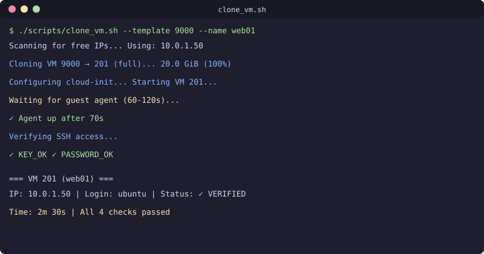

<div align="center">

[](README.md)
[](README.ru.md)
[](README.uz.md)

</div>

# Proxmox Day-2 operatsiyalar vositasi


[](https://github.com/uMax-Cyber/ProxmOps/actions/workflows/ci.yml)

Production muhitida sinovdan oʻtgan skriptlar va qoʻllanmalar — mustaqil (standalone) Proxmox VE nodelarida kundalik day-2 operatsiyalari uchun: cloud-init orqali virtual mashinalarni yaratish, disk hajmini oʻzgartirish, oltin shablonlarni boshqarish va tekshiruvga asoslangan ish oqimlari.

## Ichida nima bor

### 🖥 Virtual mashina yaratish (cloud-init)
- «Oltin yoʻl» boʻyicha klonlash oqimi (shablon → toʻliq klon → cloud-init → tekshirish)
- QEMU guest-agent bilan Ubuntu 24.04 cloud-image shabloni yasovchi
- Birinchi ishga tushirishda paketlarni oʻrnatish uchun vendor-snippet tizimi
- cloudimg-override tuzatishi bilan SSH kalit + parol orqali autentifikatsiya sozlamasi

### 💾 Disk operatsiyalari
- VM diskini toʻxtatmasdan (online) kengaytirish (gipervizor + mehmon tizimidagi partitsiya + fayl tizimi)
- Cloud-image joylashuvi uchun `growpart` / `resize2fs` ketma-ketligi
- LVM hamda ext4/xfs variantlari

### ✅ «Avval tekshir» tamoyili
Har bir amal quyidagi sxema boʻyicha bajariladi: **qil → tekshir → hisobot ber**. Skriptlar holatni soʻrab turadi, MAC-manzillarni ARP yozuvlari bilan solishtiradi va fayl tizimidagi oʻzgarishlarni tasdiqlaydi — shundan keyingina muvaffaqiyat deb e'lon qilinadi.

## Texnologiyalar
- Proxmox VE 9.x (mustaqil nodelar, klaster emas)
- Ubuntu 24.04 LTS cloud-obl razilari
- Bash + Python (faqat standart kutubxona, tashqi bogʻliqliksiz)

## Asosiy skriptlar

| Skript | Vazifasi |
|--------|----------|
| `scripts/clone_vm.sh` | Shablondan cloud-init bilan toʻliq klonlash |
| `scripts/resize_disk.sh` | Ikki bosqichli online disk kengaytirish (host + mehmon) |
| `scripts/seed_template.sh` | Yangi nodeda oltin shablonni yaratish |
| `scripts/verify_vm.sh` | Yaratilgandan keyingi tekshiruvlar roʻyxati |

## Amaliyotdagi tipik xatolar (real hodisalardan hujjatlashtirilgan)

1. **LXC shabloni ≠ VM diski** — `.tar.zst` konteyner shablonlarini VM diski sifatida import qilish 135MB keraksiz ma'lumot yaratadi
2. **Ping ga javob beradigan IP ≠ boʻsh IP** — tayinlashdan oldin albatta skanerlang; zich subnetlarda «jim» egalari boʻladi
3. **cloudimg SSH override** — Ubuntu cloud-obl razilari `/etc/ssh/sshd_config.d/` ichida `PasswordAuthentication no` bilan keladi; faqat `cipassword` buni bekor qilmaydi
4. **VM qayta yaratilganda SSH sozlamalari tiklanadi** — destroy+clone tsikli cloud-image standart sozlamalarini qaytaradi; har qayta yaratilgandan keyin SSH tuzatishini qayta qoʻllang

## Ishlatish

```bash
# Oltin shablondan VM klonlash
./scripts/clone_vm.sh --template 9000 --name webserver --ip 10.0.0.50

# Diskni online kengaytirish (toʻxtatishsisiz)
./scripts/resize_disk.sh --vmid 102 --disk scsi0 --size 50G

# Yaratishni tekshirish
./scripts/verify_vm.sh --vmid 102 --expected-ip 10.0.0.50
```

## Litsenziya
MIT

## 📬 Aloqa

Savollaringiz bormi? Yozing: **[allumaxmail@gmail.com](mailto:allumaxmail@gmail.com)**

---

<div align="center">

[](README.md)
[](README.ru.md)
[](README.uz.md)

</div>
